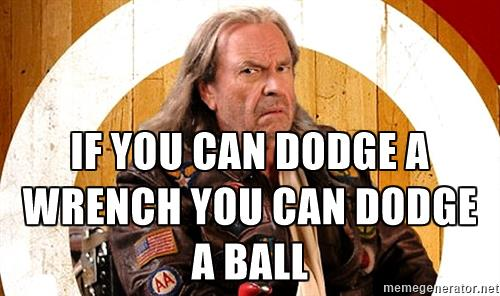
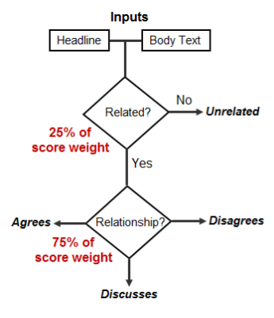
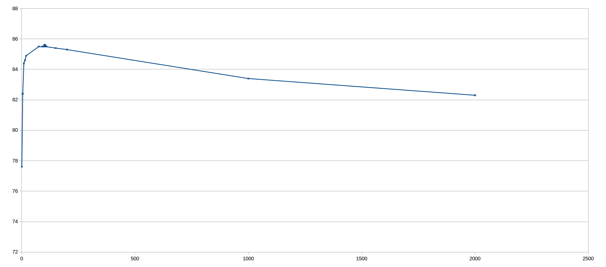
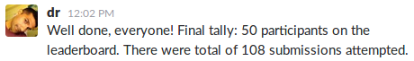

# Fake News Challenge Update

*Written by B[]; Last updated: 04/06/2017*

## Introduction

### Motivation

The Netizens team is a student led hacking team, a group part of the University
of Hertfordshire that has many cyber security projects. These projects come in
many forms, including hardware, software, procedures and much more. One of
these interests has been the Fake News Challenge, or FNC as we have come to
refer to it.

### Why Fake News?

Our thinking is, "if you can detect fake news, you can detect malicious social
hacking". This could be in the form of phishing emails, scamming websites or
malicious programs. The ability to detect human deception attempts allows for a
whole class of systems that detect users. Bringing artificial intelligence to
these systems allows for smarter detection.

## Competition

### Background

Fake news, as defined on the FNC site, by the New York Times:

    Fake news, defined by the New York Times as “a made-up story with an
    intention to deceive” 1, often for a secondary gain, is arguably one of the
    most serious challenges facing the news industry today. In a December Pew
    Research poll, 64% of US adults said that “made-up news” has caused a
    “great deal of confusion” about the facts of current events 2.

The goal of the competition is to explore how modern techniques in machine
learning and artificial intelligence can be used to fact check news sources.
Doing so is considered if a time consuming and often difficult task for
experts, but automating the process with *stance detection* allows for fast
classification of news sources if accurate.

More can be found [here](http://www.fakenewschallenge.org/).

### Problem Formalisation

The formalism of the stance classification is defined as follows:

    Input
      A headline and a body text - either from the same news article or from
      two different articles.
    Output
      Classify the stance of the body text relative to the claim made in the
      headline into one of four categories:
        1. Agrees: The body text agrees with the headline.
        2. Disagrees: The body text disagrees with the headline.
        3. Discusses: The body text discuss the same topic as the headline, but
        does not take a position
        4. Unrelated: The body text discusses a different topic than the
        headline

The scoring is done as follows:

There are several rules associated with the competition:

* Only use the provided data.
* Winning teams must open source their solutions with the Apache 2.0 licence.
* Have fun.

## Design

### Initial Thoughts

Our initial design thinking was to produce a framework that would allow us to
attempt several different ideas, having the data input and data output all
handled by the program. The next line of thinking was to have the program
automated via the terminal, so that we could test multiple implementations over
some long period of time and come back and analyse the results.

This was done is Java, as it was considered an easy language to implement this
in and allows for debugging. Our team members also use multiple different
development OSes, so we decided to use a language that works on most. In
hindsight, a data orientated (such as R or Python) would have been more
appropriate - live and learn.

For our initial design, we implemented 1st nearest neighbour. This gave us very
poor results, not matching anything other than one label.

Due to implementation, running the program was taking 10 hours, for single
nearest neighbour! We stored our database in RAM as strings and casted to
numeric values each time - that was incredibly slow. After realising our
mistake, we got our timing down to about a minute for analysing and matching -
much better!

### Improvements

We later found a few more problems in our coded:

* The classification wasn't working correctly
* The code doesn't easily extend to multiple nearest neighbours

A re-write soon sorted this and were able to validate that our code was indeed
working as intended. Impressively, even for K values larger than 100, we were
still able to classify our data in the order of minutes.

## Implementation

### Source Code

Please refer to our
[snapshot repository](https://github.com/danielbarry/fake-news-challenge) for
the source code for our version of the software for the competition.

**TODO:** Discuss the code layout.

The code can be visualised as follows
([source](fake-news-challenge-update/fnc-overview.xml)):

As you'll see, everything has been completely written from scratch - not a
single line has been borrowed from somewhere. If anything, this makes this
project impressive within it's own right.

The following is a description of each class and it's purpose:

* **Classifier.java** - *Interface* - Define how classifiers are represented in
the program.
* **Database.java** - The basic database handler for the CSV files.
* **DataSet.java** - The basic dataset structure handling a combination of the
titles and bodies.
* **Fix.java** - Fixes the output file to be competition ready.
* **KNear.java** - Defines the K-nearest neighbours algorithm for
classification.
* **Main.java** - The main entry into the program, responsible for handling the
command line parameters and starting the program logic.
* **MarkerEntropyBody.java** - Calculates the entropy of the body data.
* **MarkerEntropyHead.java** - Calculates the entropy of the head data.
* **Marker.java** - *Interface* - Define how markers are represented in the
program.
* **MarkerMatchDictBody.java** - Calculates the number of matching words for
the body and a dictionary.
* **MarkerMatchDictHead.java** - Calculates the number of matching words for
the head and a dictionary.
* **MarkerNumWordsBody.java** - Calculates the number of words in the body data.
* **MarkerNumWordsHead.java** - Calculates the number of words in the head data.
* **MarkerNumWordsMatch.java** - Calculates the number of words that match in
the head and body.
* **MarkerNumWordsRatio.java** - Calculates the number of words ratio between
the head and body.
* **Scorer.java** - Checks the result of the scoring process.

Further comments exist in the source files themselves.

### Break Down

#### Configuration

Running the following:

    ant; java -jar fnc.jar -h

Reveals:

    ./fnc.jar [OPT]
    
      OPTions
    
        -c  --clss    Classified data
          <FILE>   CSV titles file
          <FILE>   CSV bodies file
        -h  --help    Displays this help
        -k  --kner    Set the K for k-nearest
          <INT>    Number of nearest
        -j  --jobs    Set the number of jobs to run
          <INT>    Number of jobs
        -m  --mode    Set the mode
          knear    (def) k-nearest neighbours
        -r  --runs    Set the number of runs
          <INT>    Number of runs
        -u  --ucls    Unclassified data
          <FILE>   CSV titles file
          <FILE>   CSV bodies file
        -f  --fix     Fixes the results to it's original form.
          <FILE>      The original whole titles database

The options are self explanatory, but of interest to us is in particular is the
K value, which allows us to define how many nearest neighbours we take into
consideration. In the results section, we see the outcome of varying our K
value.

#### Markers

The following is the `Marker.java` interface (without comments):

    public interface Marker{
      public String getName();
      public double analyse(DataSet ds, int y);
    }

As you can see, it's very simple. Each of the makers is given a reference name,
as well as accepting the data to analyse at a given position and then returning
a `double` value associated with it. This `double` value can be the full range
of `double`, where it is normalised after.

We have the following types of markers:

* **Number of Words** - This is the number of words given in each set. The
thinking here is that longer articles would require a higher time investment,
so people may be likely to write shorter articles if they are producing fake
news.
* **Ratio of Number of Words** - This is the ratio of how long the head is
compared to the body. This line of thought was for the possibility of having a
disproportionally long head or body when compared to their counter. Fake news
might be a harder sell and therefore a longer title or real news may have
richer content, therefore longer titles.
* **Number of Words Match** - This is the number of matching words. Obviously,
if a title talks anything about the body, you would hope they have matching
  words somewhere.
* **Dictionary Match** - Match the top 100 words with an quadratic back off.
The more used the word, the higher the rating. The thinking here was that a
person writing fake news may not have the greatest vocabulary, or a good writer
may use common words to make articles more readable.
* **Entropy** - A calculation of the entropy of the words, again people writing
fake news may be tempted to repeat their sentences. Equally, somebody writing a
well written article may repeat points for clarity.

**NOTE:** We actually ended up turning off the dictionary match marker, as this
actually made the matching process harder.

## Results

### Our Results

During our initial testing, we were getting results above 85% when classifying
80% of the training data, using 20% of the training data to train.

Varying the K value had a large affect and there was clearly an advantage to
looking at about 105 of a node's nearest neighbours for the purpose of
classification.

Our actual results were 83.0% using the new test data, trained with the
previously released training data. This is considerably lower than our original
classification, but this is understandable given the amount of overlap in our
previous data training data.

### Competition Results

One additional restraint added at the end of the competition was that 1 hour
before closure, at 23:59 GMT on the 2nd of June, the results table would go
"dark" in order to add some additional mystery to who the winner is.

Below we have the results table, pulled at 22:56 GMT:

    submission_pk User             score
    404231        seanbaird        9556.500 (1)
    404214        athene           9550.750 (2)
    404189        jaminriedel      9521.500 (3)
    404185        shangjingbo_uiuc 9345.500 (4)
    404142        enoriega87       9289.500 (5)
    404228        OSUfnc2017       9280.500 (6)
    404205        florianmai       9276.500 (7)
    404197        humeaum          9271.500 (8)
    403966        pebo01           9270.250 (9)
    404194        gtri             9243.000 (10)
    404226        jamesthorne      9189.750 (11)
    404133        Soyaholic        9146.250 (12)
    403872        ezequiels        9117.500 (13)
    404233        Tsang            9111.500 (14)
    404129        siliang          9103.750 (15)
    404062        neelvr           9090.750 (16)
    404080        stefanieqiu      9083.250 (17)
    404215        htanev           9081.250 (18)
    404221        tagucci          9067.000 (19)
    404070        saradhix         9043.500 (20)
    404137        acp16sz          8995.750 (21)
    404176        Gavin            8969.750 (22)
    404092        JAIST            8879.750 (23)
    404114        subbareddy       8855.000 (24)
    404025        amblock          8797.500 (25)
    404036        annaseg          8797.500 (25)
    403978        Debanjan         8775.250 (26)
    404183        johnnytorres83   8761.750 (27)
    404086        avineshpvs       8539.500 (28)
    403858        bnns             8349.750 (29)
    404108        gayathrir        8322.750 (30)
    404076        MBAN             8321.000 (31)
    404209        martineb         8273.750 (32)
    403809        contentcheck     8265.750 (33)
    404204        vivek.datla      8125.750 (34)
    404227        vikasy           7833.500 (35)
    404175        barray           7778.250 (36)
    404232        MicroMappers     7420.250 (37)
    404082        borisnadion      7160.500 (38)
    403913        etrrosenman      7106.750 (39)
    404033        agrena           6909.750 (40)
    404056        gpitsilis        6511.750 (41)
    404224        mivenskaya       6494.750 (42)
    403851        rldavis          5617.500 (43)
    404065        isabelle.ingato  5298.500 (44)
    404049        daysm            4911.000 (45)
    404184        mrkhartmann4     4588.750 (46)
    404106        bertslike        4506.500 (47)

All-in-all, it seems as though we had 50 entries in total - so by extension
some people entered when the score board finally went dark. Given our position
in the table, if they randomly placed it is likely they placed above us. This
means we placed a respectable 36-39 out of 50.

## Conclusion

So now, we look at how things have gone in reflection.

Thinking about the implementation, I think we're mostly happy to have travelled
the road we have in terms of the learning experience involved with writing
everything from scratch. Of course, given the opportunity again, I think we
would possibly explore the idea of the using a higher level system for
analysing the data, possibly as several different tools rather than one large
rolled tool.

This also comes down to the classic "given more time". Both the people on our
team were extremely pressed for time with various happenings, both of us
leaving the UK for other Countries, as well as many other University related
pressures. This project really only saw a day perhaps in a month - so it's
impressive it got this far.

Speaking of being impressed, it's surprising how far you can get with just a
k-nearest neighbour algorithm. It's certainly fast! You could very easily label
data on the fly, possibly even in browser per client if you were using this as
a web tool.

We didn't come last! Given our limited time, our long path to solving the
problem, miraculously we didn't even come last in solving the problem. 83.0%
classification of some completely unknown data is really not too bad at all.

The competition itself was run very nicely, given the number of people
competing from various Countries and time zones. Some things could have been
done better, but considering this was their first attempt and they were not
sure how successful it would be - I think this is an impressive accomplishment
to those involved. Hats off to them.

Lastly, this competition is called "FNC-1", the "1" implying it's the first in
a series. I think we would definitely be interested in competing next year!
