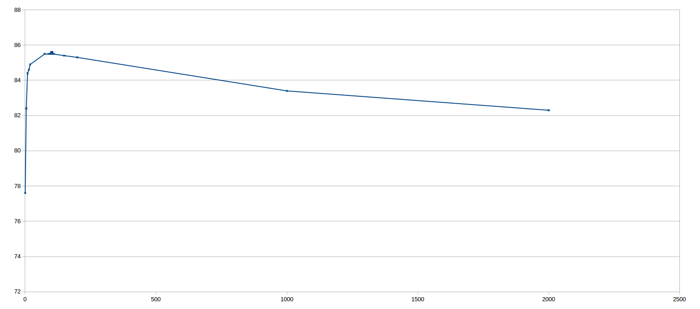

# Fake News Challenge

*Written by B[]; Last updated: 21/03/2017*

## Current State

**The competition is is in progress, so we can't give away too much yet!**
Below is our not-so-detailed release of information until the end of the
competition. Be sure to come back for more updates!

More information about the competition can be seen
[here](http://www.fakenewschallenge.org/).

## K-Nearest Algorithm

Currently we are having some good success with the K-Nearest algorithm, scoring
just over 85% in classification tests. The below diagram shows how results vary
depending on how we vary how many neighbours we take into consideration.

This initially identifies that our method works and that we are able to achieve
good results with a simple nearest-neighbour clustering algorithm. The next
step will be to find better classifiers and to experiment with different
algorithms.

## Database

Currently, we have a completely custom implementation for handling the database
(see below), which has caused some issues when running `scorer.py` to check our
results.

As you can see by the outlined methods, this took some time to implement but
did allow us to have a Database fully contained in RAM for processing.

    /**
     * Database.java
     *
     * This class handles the arbitrary database as set by the Fake News Challenge,
     * allowing the data to be loaded and saved. The data in this class can be of
     * any type, as long as it is of type CSV. The user of this class is
     * responsible for knowing the type of data that is stored.
     **/
    public class Database{
      /**
       * Database()
       *
       * Load the database from file if it exists, into memory.
       *
       * @param filename The filename to be used for loading and saving of the
       * database.
       **/
      public Database(String filename);
    
      /**
       * Database()
       *
       * Create a new database in RAM with the specified structure.
       *
       * @param filename The filename to be used for loading and saving of the
       * database.
       * @param header A String containing the first CSV row, labelling the data
       * individually.
       **/
      public Database(String filename, String header);
    
      /**
       * validHeader()
       *
       * Validates whether the header is correct in form, returning the number of
       * separate entities.
       *
       * @param header The header String to be tested.
       * @return The number of headers in the header String, otherwise -1 if there
       * is a fault.
       **/
      private int validHeader(String header);
    
      /**
       * validEntry()
       *
       * Validates whether a entry row is correct in form, returning an array of
       * the formatted String data.
       *
       * @param entry The entry String to be tested.
       * @return The correctly formatted String array, otherwise NULL.
       **/
      private ArrayList<Object> validEntry(String entry);
    
      /**
       * getWidth()
       *
       * Get the width of our data (columns).
       *
       * @return The width of the data.
       **/
      public int getWidth();
    
      /**
       * getHeight()
       *
       * Get the height of our data (rows).
       *
       * @return The height of the data.
       **/
      public int getHeight();
    
      /**
       * getString()
       *
       * Get the data String at a given column and row.
       *
       * @param col The column to retrieve the data from.
       * @param row The row to retrieve the data from.
       * @return Get the String at the given location, NULL if data doesn't exist.
       **/
      public String getString(int col, int row);
    
      /**
       * getDouble()
       *
       * Get the data Double at a given column and row.
       *
       * @param col The column to retrieve the data from.
       * @param row The row to retrieve the data from.
       * @return Get the Double at the given location, NULL if data doesn't exist.
       **/
      public Double getDouble(int col, int row);
    
      /**
       * setData()
       *
       * Set the data String at a given column and row.
       *
       * @param col The column to set the data.
       * @param row The row to set the data.
       * @param elem The element to set into the dataset.
       **/
      public void setData(int col, int row, Object elem);
    
      /**
       * getHead()
       *
       * Get the head String at a given column.
       *
       * @param col The column to retrieve the data from.
       * @return Get the String at the given location, NULL if data doesn't exist.
       **/
      public String getHead(int col);
    
      /**
       * setHead()
       *
       * Set the head String at a given column.
       *
       * @param col The column to set the data.
       * @param elem The element to set into the dataset.
       **/
      public void setHead(int col, String elem);
    
      /**
       * saveDatabase()
       *
       * Saves the current database to disk.
       **/
      public void saveDatabase();
    
      /**
       * loadFile()
       *
       * Load the file from the disk into a String array, split by the lines
       * loaded.
       *
       * @param file The file to be loaded from disk.
       * @return An Object array of text lines contained in the file, NULL on a
       * failure.
       **/
      private static ArrayList<Object> loadFile(File file);
    
      /**
       * saveFile()
       *
       * Save the file to disk, in a CSV format.
       *
       * @param file The file to be saved to disk.
       * @param head The header data.
       * @param data The rows data.
       **/
      private static void saveFile(
        File file,
        ArrayList<Object> head,
        ArrayList<ArrayList<Object>> data
      );

**NOTE:** Embarrassingly, the original implementation meant that we were doing
parsing from `String` to `double` for every operation and then back again.
Running our initial tests took over 10 hours! Casting `Double` and `String`
objects to type `Object` and back was a significant speed improvement. Now
running the experiments takes just a few minutes - lesson learned!
